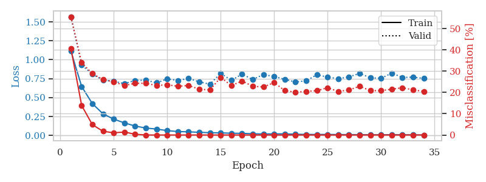
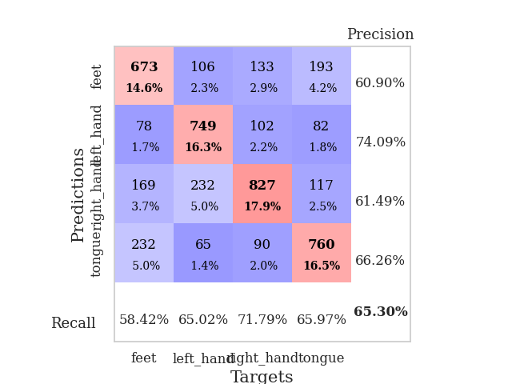

# 📂 Log

In diesem Verzeichnis befinden sich alle während des Trainings und der Evaluation generierten Ausgaben – darunter Visualisierungen, Konfusionsmatrizen, Trainingsmetriken sowie Vergleichsanalysen zwischen Datensätzen.

---

## 📁 Unterverzeichnisse

### 📂 `subject1` – `subject9`

**Inhalt pro Ordner:**

* 📈 Individueller Trainingsverlauf des jeweiligen Subjekts
* 📊 Konfusionsmatrizen für Cross-Evaluation: Das Subjekt wurde mit allen verfügbaren Modellen getestet, um Generalisierungsfähigkeit sichtbar zu machen

Beispielhafte Datei:

* `subject1/training_epochs_windows_dataset.png`
* `subject1/subject1_confusion_matrix_epochs_windowsdataset.png`

---

### 📂 `MOAM` (Model of All Models)

**Inhalt:**

* Konfusionsmatrizen zur Evaluation jedes Subjekts mit dem Modell, das auf **allen Subjekten gemeinsam** trainiert wurde
* Trainingsverlauf des MOAM-Modells

---

### 📂 `leave_one_out`

**Inhalt:**

* Trainingsverläufe und Konfusionsmatrizen für Modelle, bei denen jeweils ein Subjekt ausgelassen wurde („Leave-One-Subject-Out“)
* Beispiel: `leave_one_out_subject3_confusion_matrix.png` zeigt die Evaluation des auf allen außer Subjekt 3 trainierten Modells mit Testdaten von Subjekt 3

---

### 📂 `Compare_datasets`

**Inhalt:**

* Grafische Gegenüberstellungen von Datensätzen aus MOABB und GDF-Quelle
* Plot-Beispiele zur Vergleichbarkeit von Struktur, Auflösung und Signalverläufen

---

## 📈 Trainingsverläufe

Zeigen typischerweise:

* Trainingsverlust (Loss)
* Fehlklassifikationsrate (Misclassification Rate)

Beispielhafte Visualisierung:

Weitere Dateien:

* `training_100samples.png`
* `training_250samples.png`
* `training_500samples.png`

---

## 📊 Konfusionsmatrizen

Zeigen die Modellleistung in Bezug auf Klassifikationstreue:

Weitere Varianten:

* `confmat_100samples.png`
* `confmat_125samples.png`
* `confmat_500samples.png`

---

## 📑 Metriken & Vergleichstexte

Zusätzliche Ausgaben zu GDF/MOABB-Vergleichen:

* z. B. MAE, RMSE, Korrelationen

Dateibeispiel:

* `comparison_metrics.txt`

---

## ℹ️ Hinweis

Viele dieser Dateien wurden automatisch während der Modelltrainings und Tests erzeugt und dienen der Analyse, Reproduzierbarkeit und visuellen Darstellung der Ergebnisse.

